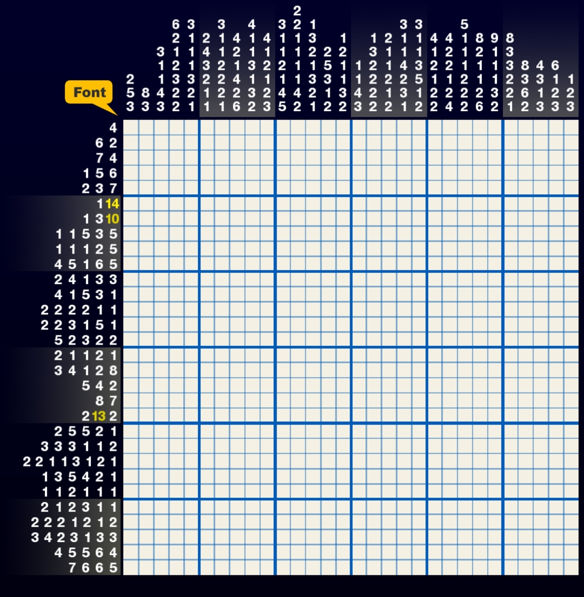

# Nonagram solver

## example

**puzzle:**



**input**

```go
var puzzles = Puzzle{
    RowSize: 30,
    ColSize: 30,
    RowClues: []Clue{
        []int{4},
        []int{6,2},
        []int{7,4},
        []int{1,5,6},
        []int{2,3,7},
        []int{1,14},
        []int{1,3,10},
        []int{1,1,5,3,5},
        []int{1,1,1,2,5},
        []int{4,5,1,6,5},
        []int{2,4,1,3,3},
        []int{4,1,5,3,1},
        []int{2,2,2,2,1,1},
        []int{2,2,3,1,5,1},
        []int{5,2,3,2,2},
        []int{2,1,1,2,1},
        []int{3,4,1,2,8},
        []int{5,4,2},
        []int{8,7},
        []int{2,13,2},
        []int{2,5,5,2,1},
        []int{3,3,3,1,1,2},
        []int{2,2,1,1,3,1,2,1},
        []int{1,3,5,4,2,1},
        []int{1,1,2,1,1,1},
        []int{2,1,2,3,1,1},
        []int{2,2,2,1,2,1,2},
        []int{3,4,2,3,1,3,3},
        []int{4,5,5,6,4},
        []int{7,6,6,5},
    },
    ColClues: []Clue{
        []int{2,5,3},
        []int{8,3},
        []int{3,1,1,4,3},
        []int{6,2,1,2,3,2,2},
        []int{3,1,1,1,3,2,1},
        []int{2,4,3,2,1,1},
        []int{3,1,1,2,2,2,1},
        []int{4,2,1,4,2,6},
        []int{4,1,1,3,1,3,2},
        []int{4,1,2,1,2,3},
        []int{3,1,1,2,1,4,5},
        []int{2,2,1,1,1,1,4,2},
        []int{1,3,2,1,3,2,1},
        []int{2,5,3,1,2},
        []int{1,2,1,1,3,2},
        []int{1,1,4,3},
        []int{1,3,2,2,2,2},
        []int{2,1,1,2,1,2},
        []int{3,1,1,4,2,3,1},
        []int{3,1,1,3,5,1,2},
        []int{4,1,2,1,2,2},
        []int{4,2,2,1,2,4},
        []int{5,1,1,1,2,2,2},
        []int{8,2,1,1,2,6},
        []int{9,1,1,1,3,2},
        []int{8,3,3,2,2,1},
        []int{8,3,6,2},
        []int{4,3,1,3},
        []int{6,1,2,3},
        []int{1,2,3},
    },
}
```